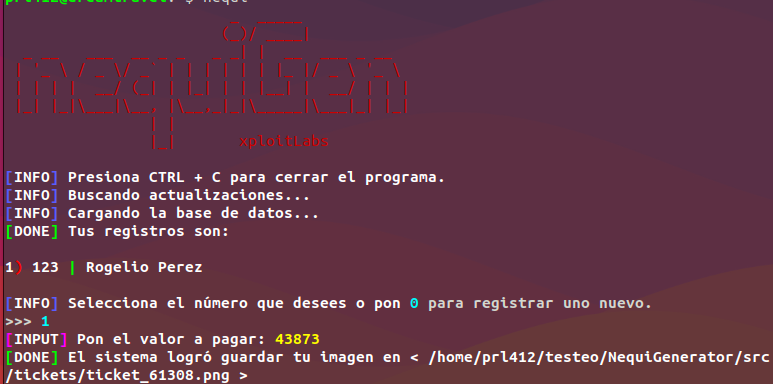

---

<h1>NequiGen 🏦</h1>

## Descripción 📝

NequiGen es un proyecto de código libre que se encarga de generar imágenes usando 3 datos que usará el usuario para poder ejecutar, el cual, le dará la capacidad de generar comprobantes de pago a través de una plantilla de NequiGen.

## Objetivos 🎯

Ofrecer la capacidad de análisis y obtención fácil y rápida de este tipo de generadores para su correspondiente uso. (NO ME HAGO RESPONSABLE DEL MAL USO QUE SE LE DÉ A LA HERRAMIENTA)

## Funcionalidades 💡

El sistema cuenta con diferentes tipos de funcionalidades que destacan frente a las demás, unas de ellas destacan:
- Sistema de actualización basada en hash de commits.
- Modulación de código, lo que lo hace rápido y bien organizado.
- Programación orientada a objetos aplicada.
- Control de actualizaciones sin arruinar los archivos locales.
- Actualizaciones con una sola respuestas

## Requisitos 🛠️

- <code>Conexión a internet</code> Este generador de imágenes funciona a través de una API en internet.
- <code>git</code> Control de actualizaciones.
- <code>requests</code> Librería para le obtención del entorno web.

## Instalación 💻

Para instalar correctamente el bot, sigue los siguientes pasos:

1) Clonar este repositorio:
    - <code>git clone https://github.com/xploitLabs/NequiGenerator</code>

 

2) Entrar al directorio:
    - cd NequiGenerator

 

3) Instalar python si no lo tienes instalado:
    - Para Ubuntu: <code>sudo apt install python3 -y</code>
    - Para Termux: <code>apt install python3 -y</code>

 

4) Instalar las dependencias y configurar a ReLU:
    - El setup es tan simple como poner el siguiente comando: <code>chmod 777 setup.sh</code>
    - Y finalmente ejecutar: <code>./setup.sh</code>

 

5) Usar el script:
    - Cierra la terminal y vuelvela a abrir, luego ejecutas el comando <code>nequi</code> para poder ejecutar el sistema de manera automática.

## Compatibilidad 🔨

|   Entorno   | Es compatible | Probado en |
|:------------:|:------------:|:------------:|
|   Windows   |   ❌   |   ❌   |
|   Linux     |   ✅   |   ✅   |
|   Termux    |   ✅   |   ✅   |

## Idiomas 🗣️

|   Idioma   | Disponibilidad |
|:------------:|:------------:|
|   Español   |   ✅   |
|   Ingles     |   ❌   |